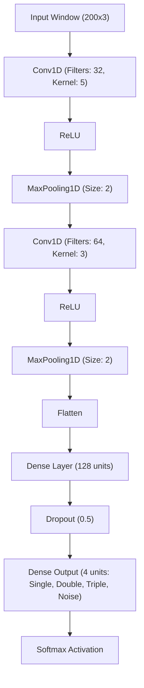

# ML Tap Detection Setup Suggestion

## 🎯 Design Decisions
*   **Model Architecture**: 1D Convolutional Neural Network (CNN)
*   **Target Frequency**: 200 Hz (using adaptive linear interpolation)
*   **Window Size**: 1000 milliseconds (1 second) = 200 samples

---

### 1. Model Architecture (1D CNN)

For time-series accelerometer data, a 1D CNN is highly effective. It treats the time axis similarly to how a 2D CNN treats images, finding local patterns (like the sharp spike of a tap).

**Input Shape**: `(200, 3)` — 200 samples, each with 3 channels (X, Y, Z axes).

#### Architecture Flow (Mermaid Diagram)

### 2. Inference Latency
*   **Compute Time**: Less than 1 millisecond on MacBook CPU/Neural Engine via CoreML.
*   **Perceived Latency**: The model looks at a sliding window of the past 1 second. It can predict a gesture as soon as the full gesture signature is present in the window.

### 3. Data Needed
*   We need around **200 to 500 samples** per class to train the CNN effectively.
*   **Classes**: `single`, `double`, `triple`, and `noise` (typing, resting hand, moving laptop).

---

## 🛠 Plan to Prepare Training Data

To collect data, we will implement a `--record` feature in the sidecar. Here is how we will gather and prepare the data:

### Step 1: Implement Sidecar Recorder
We will add a CLI flag to the sidecar:
`sudo TapSenseSidecar --record <filename>.jsonl`
This will stream raw accelerometer readings (at native ~800 Hz) directly to a JSON Lines file.

### Step 2: Data Collection Protocol
You will run the sidecar in recording mode and perform specific gestures repeatedly to build clean datasets.

1.  **Record Singles**: Run `sudo TapSenseSidecar --record single.jsonl` and perform ~300 single taps, waiting about 2 seconds between each.
2.  **Record Doubles**: Run `sudo TapSenseSidecar --record double.jsonl` and perform ~300 double taps.
3.  **Record Triples**: Run `sudo TapSenseSidecar --record triple.jsonl` and perform ~300 triple taps.
4.  **Record Desk Taps (Supported Mode)**: Run `sudo TapSenseSidecar --record desk_single.jsonl` (and `desk_double.jsonl`, etc.) and tap on the desk surface near the laptop. This will allow the model to learn and support desk taps when you use an external Bluetooth keyboard.
5.  **Record General Noise**: Run `sudo TapSenseSidecar --record noise.jsonl` and type normally, rest your palms heavily, move the laptop, or bump the table for a few minutes.

### Step 3: Preprocessing & Labeling
A Python script (which we will write) will process these raw files:
1.  **Segmentation**: Find the tap impact points and extract a 1-second window around them.
2.  **Resampling**: Apply linear interpolation to convert the raw ~800 Hz data in the window to exactly **200 Hz** (200 samples).
3.  **Output**: Save the processed data as a NumPy array or CSV ready for training in TensorFlow/PyTorch or Create ML.
